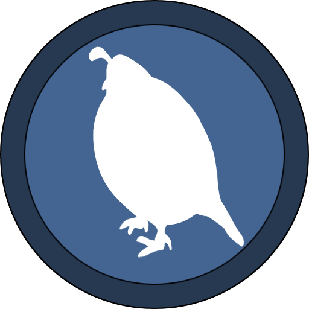

# Ruda vm

## About

This is virtual machine that Ruda binary runs on. It does not include compiler or language refferences.

If you want to use Ruda VM in your project, reffer to the main repository.

## Features
 - [x] registers, stack, heap and string memory
 - [x] homemade garbage collector
 - [x] error handling
 - [x] interface to develop libraries in Rust
 - [x] exit codes + interface for debuggers
 - [x] standard library (:heavy_check_mark:io, :heavy_check_mark:string, thread, gc) - still in development
 - [ ] WASM support
 
## How to use
VM is located in /runtime/ folder, copy files ``cargo.toml`` and ``lib.rs`` to start developing.

Alternatively you can build dll and use its interface to run Ruda VM in your project.

If you are interested in developing rust libraries, you can do so after you setup cargo project refferencing Ruda VM
and use its public trait. (more on that in libraries documentation, which is not public at the moment)

## Binary representation
Since instructions change all the time I am not going to write them here, but you can check out the runtime source, where they are documented. Search for ``pub enum Instructions`` in ``runtime/lib.rs`` to learn about them or alternatively you can look at the implementation here ``match self.code.data[self.code.ptr]``.
